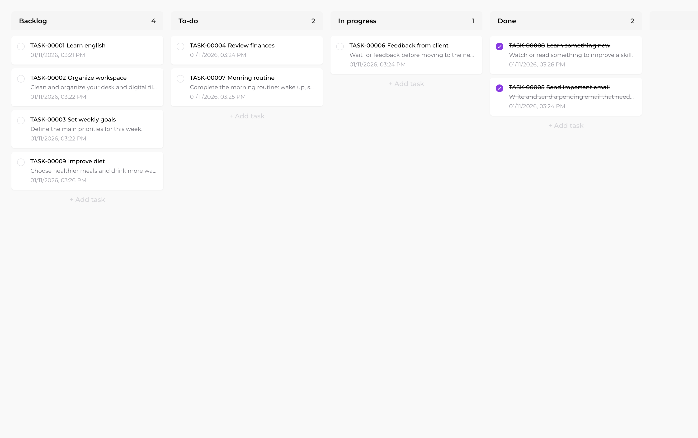

# 📋 Minimalist Kanban

<div align="center">


**A minimalist and elegant Kanban board built with Next.js, TypeScript and TailwindCSS**

[Features](#-features) • [Technologies](#-technologies) • [Installation](#-installation) • [Usage](#-usage)



</div>

---

## 📖 About

Minimalist Kanban is a modern and minimalist web application for task management using the Kanban method. Developed with a focus on simplicity, performance and user experience, it offers a clean and intuitive interface to organize your tasks in customizable columns.

### ✨ Main Features

- 🎯 **100% Kanban-focused** - No navigation bars, side menus or unnecessary elements
- 🎨 **Minimalist Design** - Clean and neutral interface, focused on usability
- 🎨 **Customizable Columns** - Customize background and text colors for each column
- 🔄 **Drag & Drop** - Drag and drop columns and tasks with ease
- 💾 **Local Persistence** - All your tasks are automatically saved in the browser
- ⚡ **Optimized Performance** - Built with Next.js 14 and React 18
- 📱 **Responsive** - Works perfectly on different screen sizes
- 🌐 **TypeScript** - Type-safe and more secure code

## 🚀 Features

### Columns

- ✅ Create, edit and reorder columns
- ✅ Customize background and text colors
- ✅ Drag & drop to reorder
- ✅ 4 default columns: Backlog, To Do, Doing, Done

### Tasks

- ✅ Create tasks in any column
- ✅ Edit title and description
- ✅ Mark as completed
- ✅ Drag between columns
- ✅ Reorder within the same column
- ✅ Description with ellipsis for long texts

### Interface

- ✅ Minimalist and clean design
- ✅ Montserrat font for better readability
- ✅ Subtle hover states
- ✅ Smooth transitions
- ✅ Modal for editing tasks and columns

## 🛠 Technologies

This project was built with the following technologies:

- **[Next.js 14](https://nextjs.org/)** - React framework with App Router
- **[TypeScript](https://www.typescriptlang.org/)** - Static typing
- **[TailwindCSS](https://tailwindcss.com/)** - Utility-first CSS framework
- **[Zustand](https://zustand-demo.pmnd.rs/)** - Lightweight state management
- **[@dnd-kit](https://dndkit.com/)** - Modern and accessible drag and drop library
- **[Lucide React](https://lucide.dev/)** - Optimized SVG icons
- **LocalStorage** - Data persistence in the browser

## 📦 Installation

### Prerequisites

- Node.js 18+ 
- npm, yarn or pnpm

### Steps

1. **Clone the repository**

```bash
git clone https://github.com/seu-usuario/minimalistic-kanban.git
cd minimalistic-kanban
```

2. **Install dependencies**

```bash
npm install
# or
yarn install
# or
pnpm install
```

3. **Run the development server**

```bash
npm run dev
# or
yarn dev
# or
pnpm dev
```

4. **Open in browser**

Open [http://localhost:3000](http://localhost:3000) in your browser.

## 🎯 Usage

### Creating a New Column

1. Click the **"+ New Column"** button at the end of the column list
2. Fill in the column title
3. Choose background and text colors (or use defaults)
4. Click **"Add"**

### Editing a Column

1. Hover over the column header
2. Click the pencil icon that appears
3. Or click directly on the column title
4. Edit the name and/or colors
5. Click **"Save"**

### Creating a New Task

1. Click the **"+ New Task"** button at the end of a column
2. Type the task title (required)
3. Add a description (optional)
4. Click **"Add"** or press `Ctrl/Cmd + Enter`

### Editing a Task

1. Click on any task
2. Edit the title and/or description in the modal
3. Click **"Save"** or press `Escape` to cancel

### Moving Tasks

- **Between columns**: Drag the task to another column
- **Within column**: Drag the task to reorder in the same column
- **Columns**: Drag the column header to reorder

### Completing Tasks

1. Click the checkbox to the left of the task
2. The task will be strikethrough and semi-transparent when completed

## 📁 Project Structure

```
minimalistic-kanban/
├── app/
│   ├── layout.tsx          # Root layout with font configuration
│   ├── page.tsx            # Main page
│   └── globals.css         # Global styles
├── components/
│   ├── Board.tsx           # Main board component
│   ├── Column.tsx          # Column component
│   ├── Task.tsx            # Task component
│   ├── TaskModal.tsx       # Modal to edit tasks
│   ├── ColumnModal.tsx     # Modal to edit columns
│   └── AddColumnModal.tsx  # Modal to create columns
├── store/
│   └── kanbanStore.ts      # Zustand store with persistence
├── types/
│   └── index.ts            # TypeScript type definitions
├── public/                 # Static files
├── package.json
├── tsconfig.json
├── tailwind.config.ts
└── README.md
```

## 🎨 Customization

### Default Column Colors

Default columns are created with:
- **Background color**: `#f3f4f6` (light gray)
- **Text color**: `#000000` (black)

You can customize colors through the column editing modal.

### Font

The project uses the **Montserrat** font via Google Fonts. The font is configured globally in `app/layout.tsx`.

## 🔧 Available Scripts

```bash
# Development
npm run dev

# Build for production
npm run build

# Start production server
npm start

# Linting
npm run lint
```

## 🚀 Production Server with PM2

The project can be run permanently using PM2, allowing access via a custom hostname (e.g., `http://minimalist-kanban`) instead of `localhost:3000`.

### Prerequisites

- PM2 will be installed as a devDependency when running `npm install`

### Initial Setup

1. **Build the project**:
   ```bash
   npm run build
   ```

2. **Configure hostname in /etc/hosts** (requires sudo):
   ```bash
   sudo nano /etc/hosts
   ```
   
   Add the line:
   ```
   127.0.0.1  minimalist-kanban
   ```
   
   Save the file (Ctrl+O, Enter, Ctrl+X in nano)

3. **Install dependencies** (if not already done):
   ```bash
   npm install
   ```

### Using PM2

**Note:** PM2 commands require `sudo` because the server runs on port 80.

```bash
# Start server (port 80)
npm run pm2:start

# Stop server
npm run pm2:stop

# Restart server
npm run pm2:restart

# View logs
npm run pm2:logs

# Remove process from PM2
npm run pm2:delete

# Save current configuration
npm run pm2:save

# Configure automatic startup on boot
npm run pm2:startup
```

### Complete Initial Setup (First Time)

1. **Build the project**:
   ```bash
   npm run build
   ```

2. **Start server**:
   ```bash
   npm run pm2:start
   ```

3. **Save configuration**:
   ```bash
   npm run pm2:save
   ```

4. **Configure automatic startup on boot**:
   ```bash
   npm run pm2:startup
   ```
   
   This command will generate a command that you need to execute. Copy and run the displayed command.

5. **Save again**:
   ```bash
   npm run pm2:save
   ```

### Access the application

After starting with PM2, access: **http://minimalist-kanban** (no port!)

### Useful PM2 Commands

```bash
# List all PM2 processes
sudo pm2 list

# Monitor processes
sudo pm2 monit

# View process information
sudo pm2 info minimalist-kanban
```

### Multiple Projects

To run multiple projects simultaneously:

1. **Each project needs a different port**: Edit `ecosystem.config.js` and change `PORT` and `name`
   - Port 80 requires sudo (recommended for access without port in URL)
   - Ports above 1024 do not require sudo (but you'll need to use `:PORT` in the URL)
2. **Add hostname in /etc/hosts**: One line per project:
   ```
   127.0.0.1  minimalist-kanban
   127.0.0.1  another-project
   ```
3. **Each project is managed independently**: Use the `pm2:*` scripts from each project

### Notes

- The server runs in production mode (requires build first)
- Auto-restart on crash
- PM2 commands require `sudo` when using port 80
- After configuring `/etc/hosts`, you may need to clear DNS cache in the browser
- After configuring `pm2 startup`, the server will start automatically after restarting the Mac

## 📝 License

This project is licensed under the MIT license. See the `LICENSE` file for more details.

## 🤝 Contributing

Contributions are always welcome! Feel free to:

1. Fork the project
2. Create a branch for your feature (`git checkout -b feature/AmazingFeature`)
3. Commit your changes (`git commit -m 'Add some AmazingFeature'`)
4. Push to the branch (`git push origin feature/AmazingFeature`)
5. Open a Pull Request

## 👤 Author

Created with ❤️ to facilitate task management in a minimalist and elegant way.

---

<div align="center">

⭐ If this project was useful to you, consider giving it a star!

Made with Next.js, TypeScript and lots of ☕

</div>
